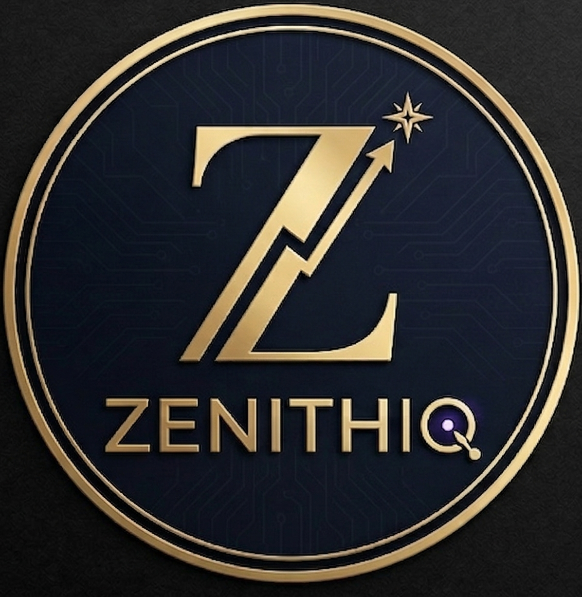

# Zenith IQ

<p align="center">
  
</p>

> AI-powered financial intelligence terminal for detecting hidden risks and alpha signals in stocks.

Zenith IQ is a multi-agent system that cross-references SEC/SEBI filings, live news, social sentiment, insider trading activity, and technical patterns to produce a composite **Alpha Score** and investor briefing — all in one terminal-style dashboard.

---

## What it does

| Signal | Source | Agent |
|---|---|---|
| Filing risk analysis | SEC EDGAR 10-K / 10-Q | FilingAgent |
| News sentiment | NewsAPI + Yahoo RSS + Finviz | NewsAgent |
| Retail sentiment | Mock social posts + RoBERTa FinBERT | SentimentAgent |
| Insider activity | OpenInsider scrape + mock fallback | InsiderAgent |
| Technical patterns | yfinance + H&S + Breakout detection | QuantAgent |
| Contradiction detection | Filing vs. news cross-check | Gemini / rule-based |

All agents run concurrently. Results are combined into a weighted **Alpha Score (0–100)** with a `STRONG BUY → STRONG SELL` signal.

---

## Tech stack

**Backend**
- Python 3.11 · FastAPI · Uvicorn
- HuggingFace Transformers (`cardiffnlp/twitter-roberta-base-sentiment-latest`)
- Google Gemini 2.0 Flash (`google-genai`)
- yfinance · pandas · scikit-learn · scipy
- Supabase (PostgreSQL + pgvector for filing embeddings)
- PyMuPDF for PDF text extraction

**Frontend**
- React 19 + TypeScript · Vite
- Tailwind CSS v4
- Lucide React icons
- Playfair Display + JetBrains Mono fonts

---

## Project structure

```
ZenithIQ/
├── agents/                  # Multi-agent system
│   ├── coordinator.py       # Orchestrates all agents, computes Alpha Score
│   ├── filing_agent.py      # SEC EDGAR → pgvector → Gemini risk summary
│   ├── news_agent.py        # NewsAPI / scraper → keyword sentiment
│   ├── sentiment_agent.py   # RoBERTa batch inference on social posts
│   ├── insider_agent.py     # OpenInsider scrape + mock fallback
│   ├── quant_agent.py       # yfinance + pattern detection + backtest
│   └── patterns/            # H&S and Breakout detectors
│       ├── head_and_shoulders.py
│       └── breakout.py
│
├── api/                     # FastAPI layer
│   ├── routes.py            # All endpoints
│   └── schemas.py           # Pydantic request/response models
│
├── data_pipeline/           # Data ingestion modules
│   ├── stock_fetcher.py     # yfinance with auto exchange suffix (.NS/.BO)
│   ├── news_scraper.py      # Yahoo RSS + Finviz + MarketWatch
│   ├── pdf_loader.py        # PyMuPDF text extraction
│   └── mock_data.py         # Mock social posts + insider activity
│
├── services/                # External service wrappers
│   ├── gemini_service.py    # google-genai client
│   ├── gemini_reasoning.py  # Contradiction + explanation logic (+ rule-based fallback)
│   └── supabase_service.py  # CRUD + pgvector upsert/search
│
├── frontend/                # React dashboard
│   └── src/
│       ├── App.tsx
│       ├── api.ts           # Typed fetch wrapper
│       ├── types.ts
│       └── components/
│           ├── ZenithDashboard.tsx
│           ├── ContradictionEngine.tsx
│           ├── AlphaScoreCard.tsx
│           ├── AgentGrid.tsx
│           ├── QuantPanel.tsx
│           ├── BlueprintOverlay.tsx  # Tour guide overlay
│           └── ...
│
├── main.py                  # FastAPI entry point
├── config.py                # Pydantic settings (reads .env)
├── requirements.txt
├── .env.example
└── .gitignore
```

---

## Quick start

### 1. Clone and set up the backend

```bash
git clone https://github.com/your-org/zenithiq.git
cd zenithiq

python -m venv venv
venv/Scripts/activate        # Windows
# source venv/bin/activate   # macOS / Linux

pip install -r requirements.txt
```

### 2. Configure environment variables

```bash
cp .env.example .env
# Edit .env and fill in your API keys
```

Required keys:

| Key | Where to get it |
|---|---|
| `GEMINI_API_KEY` | [aistudio.google.com](https://aistudio.google.com/app/apikey) |
| `SUPABASE_URL` + `SUPABASE_KEY` | [supabase.com](https://supabase.com/dashboard) → Project Settings → API |
| `SUPABASE_SERVICE_KEY` | Same page — service_role key |
| `HUGGINGFACE_TOKEN` | [huggingface.co/settings/tokens](https://huggingface.co/settings/tokens) |
| `NEWS_API_KEY` | [newsapi.org](https://newsapi.org/register) — optional, free scraper fallback available |

### 3. Set up Supabase

Run this SQL in your Supabase SQL editor to enable pgvector:

```sql
create extension if not exists vector;

create table filing_chunks (
  id           uuid primary key default gen_random_uuid(),
  ticker       text not null,
  form_type    text not null,
  filing_date  text not null,
  chunk_text   text not null,
  embedding    vector(768) not null,
  created_at   timestamptz not null default now()
);

create index on filing_chunks using ivfflat (embedding vector_cosine_ops) with (lists = 100);

create or replace function match_filing_chunks(
  query_embedding vector(768),
  match_ticker    text,
  match_count     int default 5
)
returns table (id uuid, ticker text, form_type text, filing_date text, chunk_text text, similarity float)
language sql stable set search_path = public as $$
  select id, ticker, form_type, filing_date, chunk_text,
         1 - (embedding <=> query_embedding) as similarity
  from filing_chunks
  where ticker = match_ticker
  order by embedding <=> query_embedding
  limit match_count;
$$;
```

### 4. Start the backend

```bash
venv/Scripts/python main.py
# Server runs at http://127.0.0.1:8000
# API docs at  http://127.0.0.1:8000/docs
```

### 5. Start the frontend

```bash
cd frontend
npm install
npm run dev
# Opens at http://localhost:5175
```

---

## API endpoints

| Method | Endpoint | Description |
|---|---|---|
| `GET` | `/api/v1/alpha/analyze-stock?symbol=TCS` | Fast Zenith dashboard analysis (3 agents) |
| `POST` | `/api/v1/alpha/analyse` | Full 5-agent pipeline with Gemini summary |
| `POST` | `/api/v1/analysis/contradict` | Filing vs. news contradiction detection |
| `POST` | `/api/v1/analysis/explain` | Investor-friendly explanation |
| `GET` | `/api/v1/alpha/history/{ticker}` | Past analysis results from Supabase |
| `GET` | `/api/v1/stocks/{ticker}` | Quick stock snapshot |
| `GET` | `/docs` | Interactive Swagger UI |

---

## Indian stock support

Indian NSE/BSE tickers are resolved automatically — no suffix needed:

```
TCS       → TCS.NS   (Tata Consultancy Services)
RELIANCE  → RELIANCE.NS
INFY      → INFY.NS
```

---

## Offline / fallback behaviour

Zenith IQ is designed to work even when external APIs are unavailable:

| Service | Fallback |
|---|---|
| Gemini API (quota/key issue) | Rule-based contradiction + explanation engine |
| Reddit scraping | Mock social posts (`data_pipeline/mock_data.py`) |
| OpenInsider scraping | Mock insider activity (deterministic per symbol) |
| NewsAPI | Free scrapers: Yahoo Finance RSS, Finviz, MarketWatch |
| SEC EDGAR | Returns neutral score, no crash |

---

## Three views

**Zenith Dashboard** — fast 3-agent analysis with score gauge, narrative conflict, sentiment divergence, and quant insight panels.

**Contradiction Engine** — side-by-side filing vs. news comparison with terminal-style AI output and a "CONFIRMED DISCREPANCY" stamp on critical mismatches.

**Alpha Analysis** — full 5-agent deep dive with per-agent score breakdown, key risks, AI summary, and technical pattern details.

Each view has a **blueprint-style tour guide** that walks through the UI on first visit.

---

## License

MIT
